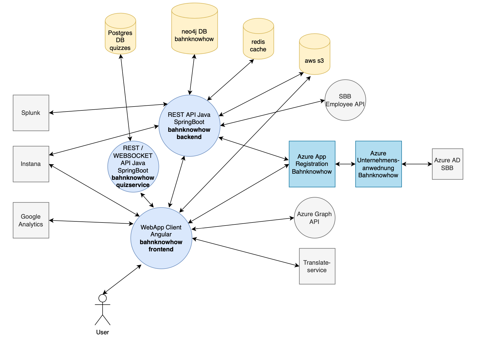
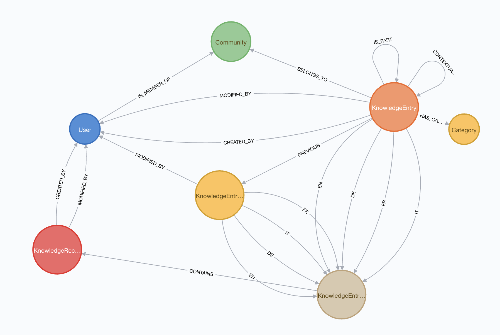
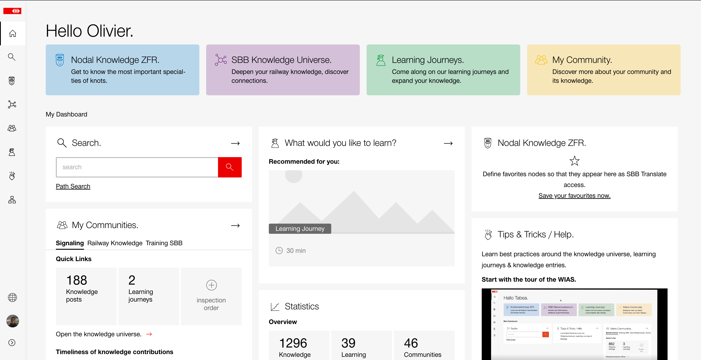
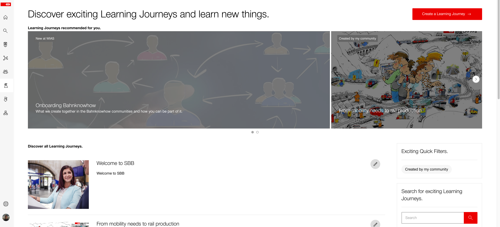
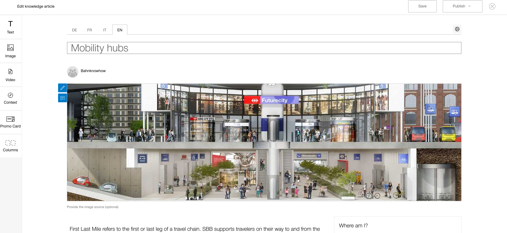

<h1>Bahnknowhow @ SBB (2020 - 2022)</h1>

During almost 2 Years, I was one of many core developers building this long anticipated application for saving important company intern knowledge. You can imagine this application something like a wiki on steroids :D (including games, quizzes & roadmaps)

<h2>What is Bahnknowhow?</h2>

By railway know-how we mean the railway-specific knowledge that forms the basis for SBB's many years of success. This includes both the overarching contextual knowledge of the railway system as a whole as well as subject-specific operational knowledge.We want to systematically record, maintain and further develop our rail know-how in order to lay the foundation for value creation as an integrated rail company. The Knowledge Assistant (WIAS) is intended to support employees in the maintenance of knowledge on the one hand, but also to make access to knowledge easier in order to make it more available to employees. 

<h3>What does our initiative on SBB rail know-how entail?</h3>
With the Knowledge Assistant (WIAS), an integrated knowledge, work and learning infrastructure was established. We have identified and captured the relevant railway know-how and made it easily accessible. In order to manage this effectively, however, reliable group-wide structures are needed, which are to be created with the development of the knowledge communities. For the SBB knowledge management with WIAS we have agreed on some principles:

- Increased focus on interrelationships in the overall railway system

- Bringing the question of why and contextual knowledge back into focus

- The active development and transfer of railway know-how is to be promoted throughout SBB

- SBB's railway know-how is stored in a structured manner, linked and easily accessible digitally for employees

- We want to present railway know-how in the most exciting way possible and make it tangible for employees.

- The documented railway know-how forms the basis of existing and new educational products and thus ensures the active use and dissemination of knowledge

<h3>Why is the topic of railway know-how so important?</h3>

With the retirement wave of 25% of employees over the next 10 years, SBB will lose the experience of 500,000 years of service. This relates in part to the specific expertise of employees in individual roles, but also to overarching knowledge of interrelationships in the overall railway system.

Due to the changing careers of employees (less of the classic 40-year working life within various functions of the railway, instead more changes of sector and increased specialisation), there is often a lack of knowledge of overarching contexts. This railway knowledge of overall and system interrelationships is strongly informal, i.e. hardly documented. Some of it is concentrated on a few knowledge carriers, but it is of strategic importance for SBB's value creation. In order to counteract these trends, the Bahnknowhow programme was launched.

<h3>How do we want to secure, develop and make available SBB knowledge?</h3>

Railway knowledge can be presented in different ways, in knowledge elements (at different altitudes), contexts (especially overarching) and in the form of learning journeys (as a story, linked knowledge elements explained with the help of an example). We also promote the active transfer of knowledge between employees in order to retain knowledge even in the event of retirements or staff departures.

The collection, maintenance and further development of knowledge is driven, supported and managed in decentralised communities within SBB. The added value for employees comes from easy accessibility, well-structured preparation and the integration of learning into daily work.

<h3>Who do we work with and how?</h3>
The acquisition of railway knowledge in WIAS should not remain a one-off exercise. The management (creation, maintenance, further development) of the knowledge content created is to be ensured by knowledge communities. Railway know-how thrives on exchange and cooperation between the employees of the divisions. In open community structures with the relevant experts, cadres and junior staff, railway know-how is actively cultivated and the benefits continuously optimised and expanded. The overarching Bahnknowhow community coordinates and supports the work of the individual knowledge communities and ensures the link to the management structures within the Group and the operational training organisation.

 

<h3>Technologies</h3>

 

 

<h3>Overview Architecture</h3>

<h3>Data Structure Example in Neo4j</h3>

 

<h3>Demo</h3>
<h4>Dashboard</h4>

<h4>Knowledge Map</h4>

<h4>Knowledge Universe</h4>

<h4>Learning Journeys</h4>

<h4>Knowledge Entry</h4>

<h4>Knowledge Entry - Editor</h4>

