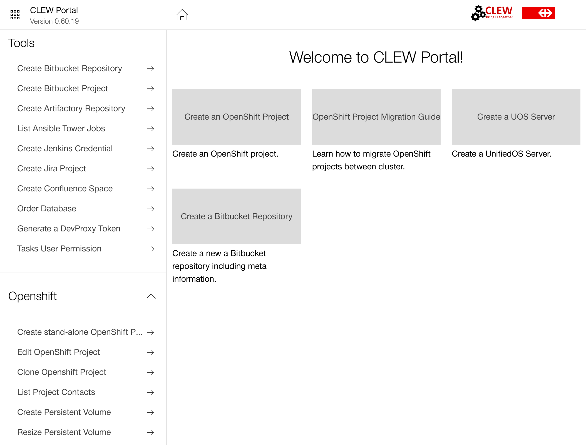
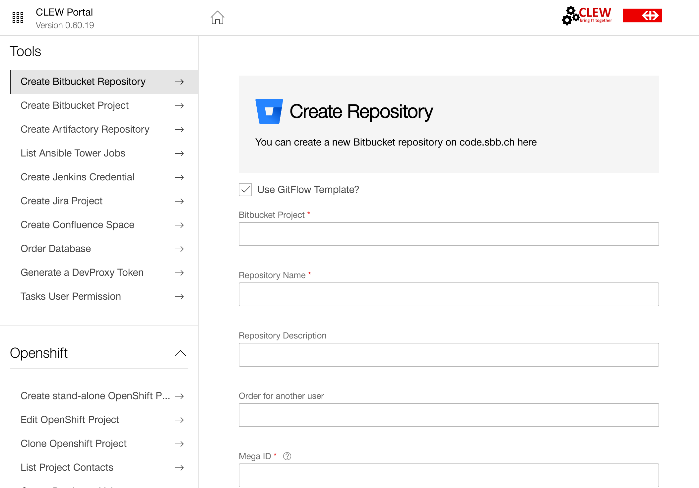

<h1>Self Service Portal @ SBB (2019 - 2020)</h1>

We at SBB own a lot of projects which receive changes all the time. As those settings are (and that is fine) limited to administrative roles, we had to do a lot of manual work.

Because of that we built this tool which allows users to execute certain tasks in self service. The tool checks permissions & multiple defined conditions.

It allows you to do one of the following tasks:

- OpenShift
    - Adjust project quotas
    - Create project
    - Create trial project
    - Show project admins
    - Display / Update project details
    - Create docker pull secret
    - Create persistent volume
    - Expand (resize) persistent Volume
    - Recreate GlusterFS configuration
- AWS
    - List S3 buckets
    - Create S3 bucket
    - Create S3 bucket user
    - List EC2 instances
- UOS
    - List your UOS servers
    - Create UOS server
- RDS
    - List databases
    - Create database
- Sematext
    - Show Logsene Apps
    - Create Logsene App
    - Change Logsene App Daily Volume & Limit
    - Change Logsene App Project & Accounting Number
- Artifactory
    - Create Repository
- Bitbucket
    - Create Project
    - Create Repository
- Confluence
    - Create Space
- DevProxy
    - Create Token
- Jenkins 
    - Create Credentials
- JIRA
    - Create Project
- Tasks
    - Give user permission to access tasks.sbb.ch
- Kafka
    - Topic List
    - App Management
    - Cost Forecast

 

<h3>Technologies</h3>

 

 

<h3>Overview</h3>

<h3>Example: Create Repository on Bitbucket</h3>

