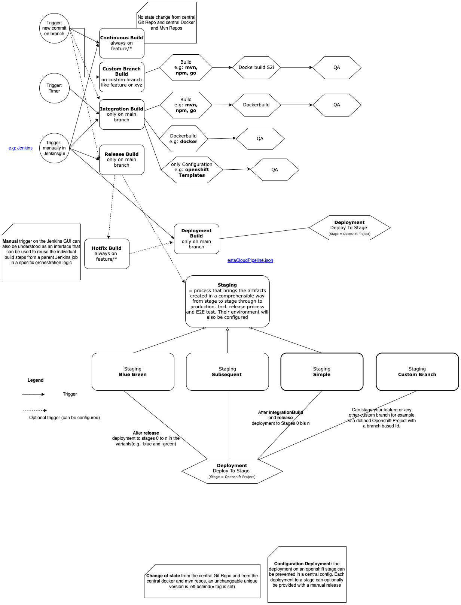

<h1>Jenkins Pipeline @ SBB (2019 - 2020)</h1>

At the begining of 2019, I helped building an automatic build pipeline on top of Jenkins. The team helped build the standardized buildprocess at SBB.

<b>What it is about</b>

The Esta-Cloud-Pipeline provides a configurable standard procedure for builds (inc. Release), deployment and staging.

- Easy and fast entry for projects with a minimal rampup
- Builds based on the Jenkinsfile for buildsteps like continuous, integrationbuild (ex. Nightly) and release out of the box.
- Support for the releaseconcept: ```manual```, ```triggered by scripts``` and ```hotifxbased```
- Standardized interfaces for each buildsteps and jenkinsjobs, which can be triggered by: manual, branchevent, timed or triggered by an orchestration jenkinsjob

- Staging's: 
    - ```Simple```: easy push forward and hotfix branch based, free variant
    - ```Blue Green```: multiple parallel streams over all configurable stages
    - ```Microservice Staging```: Full Blown Staging with automatic E2E Tests (in preparation)
    - ```Lean Gitflow``` is used as Gitflow:
        - Development is done on feature branches
        - Pullrequest are done from feature to the master branch
        - Release is done directly from master to master

<b>Configuration Example via JSON-Config</b>

The Esta Cloud Pipeline is mapped via a central configuration structure in JSON format. By default this configuration file is called estaCloudPipeline.json and is located in the same directory as the Jenkinsfile

```
{
  "$schema": "http://json-schema.org/draft-07/schema",
  "mainBranch": "master",
  "hotfixBranch": "hotfix",
  "docker": {
    "artifactoryDockerRepo": "blueprint-replace-with-your-own.docker",
    "openshiftAppName": "replace-with-openshift-app-name"
  },
  "helm": {
    "repository": "blueprint-replace-with-your-own.helm",
    "chart": "blueprint",
    "release": "blueprint"
  },
  "mvn": {
    "parentPom": "pom.xml",
    "deployableArtifactsPom": "pom.xml",
    "artifactoryMavenRepo": "blueprint-replace-with-your-own.mvn"
  },
  "stages": [
    {
      "stageName": "dev",
      "isOpenshiftDeploymentEnabled": true,
      "openshiftCluster": "replace-with-openshift-cluster",
      "openshiftProject": "blueprint-replace-with-your-own-dev",
      "openshiftJenkinsCredentialsId": "replace-with-openshift-jenkins-credentials"
    },
    {
      "stageName": "prod",
      "isOpenshiftDeploymentEnabled": true,
      "openshiftCluster": "replace-with-openshift-cluster",
      "openshiftProject": "blueprint-replace-with-your-own-prod",
      "openshiftJenkinsCredentialsId": "replace-with-openshift-jenkins-credentials"
    }
  ],
  "steps": [
    {
      "stepType": "continuous",
      "isBuildEnabled": true,
      "sonarScanEnabled": true,
      "branchNamePrefixes": [
        "feature"
      ]
    },
    {
      "stepType": "integrationBuild",
      "isBuildEnabled": true,
      "sonarScanEnabled": true,
      "triggerBuildOnCommitEnabled": true,
      "staging": {
        "stagingType": "simple",
        "stages": [
          "dev"
        ]
      }
    },
    {
      "stepType": "release",
      "isBuildEnabled": true,
      "triggerBuildOnCommitEnabled": false,
      "staging": {
        "stagingType": "simple",
        "stages": [
          "dev", "prod"
        ]
      }
    },
    {
      "stepType": "hotfix",
      "isBuildEnabled": false
    }
  ]
}
```
<br>

<h3>Technologies</h3>


<br>
<hr>
<br>

<h3>Demo</h3>



