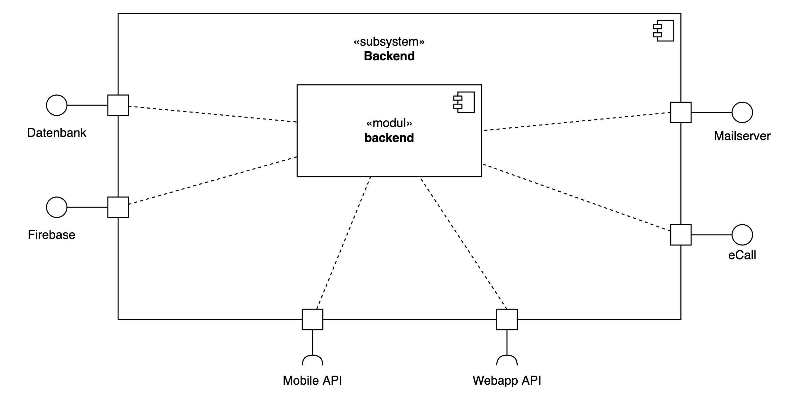

<h1>SBBgo @ SBB (2020 - 2021)</h1>

SBB always wants to improve customer satisfaction. With so many customers using our infrastructure every day, there are always a few things that stand out negatively. With SBBgo, customer management wants to fix these and thus improve customer satisfaction.  With SBBgo, selected customers and employees can join on a so-called study, in which the experience can be recorded with the help of the app at the specific place of execution. The data collected from the study participants can then be used to make targeted improvements to the culprits. 

Thanks to the collected journeys, we can see where a customer's SBB Journey begins, where it ends, which touchpoints play an important role in it, and how they are evaluated. The app enables us to get closer to the experiences and emotions of customers on their journey with SBB and to present them quantitatively or qualitatively.

<table class="tg">
<thead>
  <tr>
    <th>Requirement</th>
    <th>Benefit</th>
    <th>Details</th>
  </tr>
</thead>
<tbody>
  <tr>
    <td>App</td>
    <td>Participants can record their "experiences"</td>
    <td>The app enables study participants to record journeys during the study period. A Journey can be disputed for various reasons. During the Journey, the user takes pictures of their experience</td>
  </tr>
  <tr>
    <td>Admintool</td>
    <td>Study management</td>
    <td>The following functions can be performed in the Admintool: (Create Study, Edit Study, Overview Studies, Overview Touchpoints)
    </td>
  </tr>
  <tr>
    <td>Database</td>
    <td>Safe Data</td>
    <td>In the database data from the user & the study are stored. However, you cannot view the user data in the admin tool and thus the user data remains in the database / app
</td>
  </tr>
</tbody>
</table>

 

<h3>Technologies</h3>

 

 

<h3>Architecture</h3>

